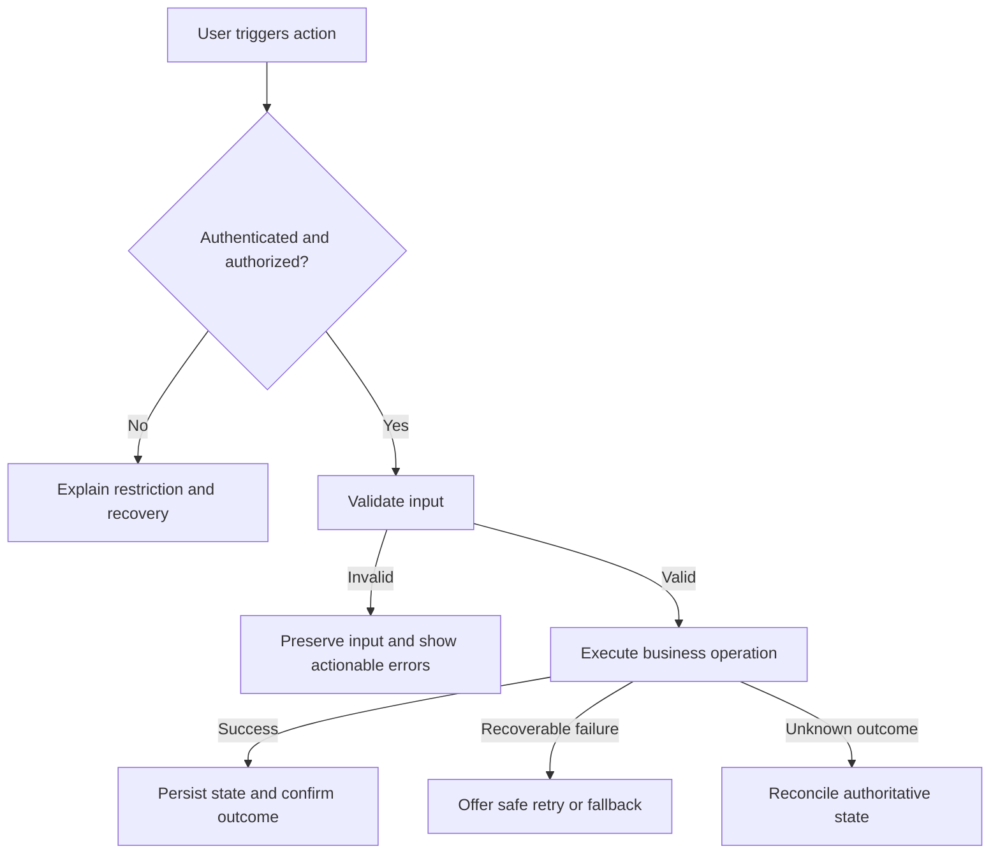
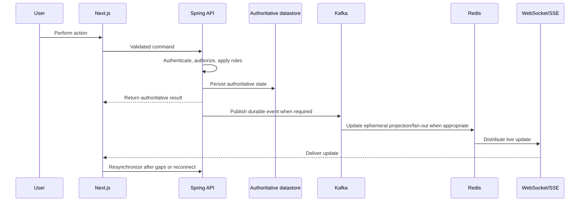

# Comprehensive Project Audit, Architecture, UX, Design, Refactoring, and End-to-End Completion Prompt

## Role and mission

Act as a senior product-minded software architect, senior full-stack engineer, UX engineer, and design-system lead.

Audit the entire repository, determine what the product is intended to do, identify every complete, incorrect, unfinished, broken, duplicated, obsolete, mocked, and missing feature, and bring the application to a correct, secure, maintainable, scalable, visually distinctive, production-ready state.

Do not stop after discovery, analysis, or planning. After producing the audit and implementation plan, execute the plan incrementally, verify every change, fix regressions, and complete all in-scope functionality end-to-end.

The frontend must use Next.js and TypeScript. Preserve the existing Next.js version and routing model when they are sound. For a new application or a justified migration, verify the current official Next.js documentation before choosing the version and architecture.

## Core outcomes

The completed work must:

- Discover and document the product purpose, users, roles, journeys, features, and constraints.
- Produce a complete feature, route, screen, API, data, permission, and integration inventory.
- Correct features that exist but behave incorrectly.
- Finish partially implemented functionality.
- replace production-path mocks, placeholders, stubs, and hard-coded temporary behavior with real implementations.
- Implement missing functionality justified by the repository, product documentation, existing flows, or explicit requirements.
- Connect frontend, backend, APIs, authentication, authorization, database, background work, and external integrations correctly.
- Make important workflows genuinely useful, understandable, forgiving, accessible, and efficient for users.
- Organize the code so that future features can be added through localized, predictable changes.
- Make failures easy to reproduce, trace, diagnose, and fix.
- Establish a coherent design system and a distinctive visual language that avoids generic AI-generated design.
- Verify critical functionality in a real browser with realistic data and all relevant UI states.
- Leave accurate engineering, product, debugging, testing, architecture, and design documentation.

## Non-negotiable operating rules

- Inspect before editing. Do not infer the system solely from filenames or screenshots.
- Establish a measurable baseline before making material changes.
- Preserve unrelated user changes and work safely in a dirty working tree.
- Do not perform destructive data, filesystem, deployment, or infrastructure operations without explicit authorization.
- Do not rewrite working architecture merely to impose personal preferences.
- Fix root causes at the correct layer instead of hiding symptoms.
- Do not weaken validation, authorization, types, or tests to make a check pass.
- Do not claim that something works unless it was verified with evidence.
- Clearly distinguish facts, inferences, assumptions, decisions, risks, and unverified areas.
- Prefer official and primary documentation for frameworks, libraries, standards, and integrations.
- Check the installed versions and repository conventions before applying current framework advice.
- Ask for clarification only when a missing decision would materially change product behavior, security, data, cost, or scope. Otherwise, make the most evidence-supported reversible assumption, document it, and continue.
- Keep progress, the feature inventory, and the implementation plan synchronized with actual repository state.
- Continue until all safe, in-scope work is complete or a genuine external blocker remains.

---

## Phase 1: Repository discovery and baseline

Inspect the complete repository, including:

- Application entry points and runtime boundaries.
- Next.js routes, route groups, layouts, templates, loading states, error boundaries, and middleware.
- React components, hooks, contexts, providers, client stores, utilities, and styles.
- Server Components, Client Components, Server Actions, Route Handlers, and server-only modules.
- Backend controllers, services, repositories, domain modules, jobs, queues, webhooks, and middleware.
- API routes, request and response contracts, validation, pagination, errors, and versioning.
- Database schema, migrations, indexes, constraints, transactions, seed data, and data-access patterns.
- Authentication, session management, roles, permissions, ownership rules, and authorization checks.
- Environment configuration, secrets handling, feature flags, build configuration, and CI/CD.
- External services, SDKs, webhooks, retries, timeouts, and failure handling.
- Tests, fixtures, mocks, scripts, linters, formatters, type-checking, and build commands.
- Product documentation, diagrams, ADRs, issue references, TODOs, FIXME comments, disabled code, and unfinished branches.
- Existing design tokens, component primitives, Storybook or equivalent examples, brand assets, and visual conventions.

Before changing code:

1. Identify the product purpose, target users, primary roles, and business-critical outcomes.
2. Map the main user journeys and system boundaries.
3. Determine the intended architecture and whether the implementation follows it.
4. Locate duplicated, inconsistent, unused, incomplete, or unreachable implementations.
5. Identify production paths that still use mocks, hard-coded data, placeholder UI, or temporary behavior.
6. Run the existing install, format, lint, type-check, test, build, and relevant application-start commands.
7. Record the baseline results without misattributing pre-existing failures to new changes.
8. Identify missing access, credentials, infrastructure, or product decisions that could block verification.

Search specifically for:

- `TODO`, `FIXME`, `HACK`, `TEMP`, `mock`, `stub`, `placeholder`, `not implemented`, skipped tests, and commented-out logic.
- Empty event handlers, no-op actions, incomplete condition branches, and swallowed exceptions.
- Buttons, links, menus, forms, and shortcuts that do not perform their intended action.
- Routes without working screens and screens without working data paths.
- APIs without consumers and UI flows that bypass existing real APIs.
- Hard-coded identifiers, roles, URLs, prices, limits, tokens, permissions, and business rules.
- Multiple conflicting definitions of the same entity, status, validation rule, or API contract.
- Client-only permission hiding without corresponding server authorization.
- Unsafe casts, broad `any` types, unexplained non-null assertions, and unvalidated external input.

### Required discovery output

Produce:

- A concise architecture map.
- A baseline validation report.
- A list of user roles and critical journeys.
- A preliminary list of blockers and risks.
- A repository-grounded feature inventory.
- A traceability matrix linking every discovered feature and subfeature to its routes, UI elements, APIs, services, events, socket messages, data stores, permission rules, tests, documentation, and current status.

---

## Phase 2: Complete feature and system inventory

Create a feature matrix containing, for every feature or module:

- Feature name and domain.
- Primary user or actor.
- Business purpose and user outcome.
- Expected behavior and critical rules.
- Entry points and complete user journey.
- Frontend route, page, and component coverage.
- Backend service and handler coverage.
- API contracts and dependencies.
- Database tables, relations, constraints, and queries.
- Authentication and authorization requirements.
- External integrations and failure modes.
- Current implementation status.
- Known defects and missing behavior.
- Security, privacy, accessibility, and performance concerns.
- Edge cases and recovery paths.
- Required tests.
- Acceptance criteria.
- Priority, dependencies, effort, and risk.

The inventory must be exhaustive down to the smallest meaningful product or system behavior. Use a hierarchy such as:

```text
Domain
  -> Capability
    -> Feature
      -> Subfeature
        -> User action or system action
          -> State, rule, edge case, failure, and recovery behavior
```

Include not only headline features, but also:

- Every route, page, tab, panel, modal, drawer, menu, command, button, link, form, field, filter, search, sort, pagination action, bulk action, shortcut, and contextual action.
- Authentication, verification, recovery, session, onboarding, profile, settings, role, permission, ownership, organization, notification, and preference behavior.
- Every API operation, Server Action, Route Handler, webhook, scheduled job, queue consumer, Kafka producer or consumer, socket event, cache behavior, background task, import, export, upload, download, and external integration.
- Every loading, skeleton, empty, partial, success, validation, conflict, stale, disabled, read-only, unauthorized, forbidden, not-found, rate-limited, offline, timeout, retry, and unexpected-error state.
- Every business rule, status transition, validation rule, permission rule, idempotency rule, concurrency rule, retention rule, and recovery path that changes observable behavior.

Assign stable identifiers to domains, features, subfeatures, flows, requirements, and acceptance criteria so they can be traced across documentation, code, APIs, database structures, tests, and implementation status. Do not renumber stable identifiers casually after they have been referenced.

Do not create separate documentation for trivial private helper functions whose behavior is already obvious from code. The required granularity is every independently meaningful user-visible behavior, business rule, integration behavior, system action, operational process, state transition, and failure or recovery path.

Classify each feature as exactly one primary status:

- Complete and verified.
- Implemented but incorrect.
- Partially implemented.
- UI-only.
- Backend-only.
- Mocked or hard-coded.
- Broken or regressed.
- Missing.
- Duplicated or obsolete.
- Externally blocked.

Do not classify a feature as complete because the page renders. It is complete only when its real data, permissions, persistence, failures, feedback, and end-to-end behavior have been verified.

---

## Phase 3: Product logic and user-centered UX

Design every workflow around the user's goal, knowledge, context, and likely mistakes rather than around internal tables or backend operations.

For each important workflow, identify:

- Who the user is.
- What they are trying to accomplish.
- Why the outcome matters.
- What they already know and what the system already knows.
- The shortest safe path to success.
- Required decisions and information.
- Success confirmation and next action.
- Loading, empty, partial, offline, stale, error, permission, and recovery behavior.
- Destructive-action safeguards and reversibility.
- Mobile, touch, keyboard, screen-reader, localization, and long-content behavior.
- Ways the system can prevent mistakes rather than only report them afterward.

Evaluate each workflow with these questions:

- Does it solve a real user problem?
- Is the next action obvious?
- Can unnecessary fields, steps, choices, or interruptions be removed?
- Can known information be reused safely?
- Does validation occur early enough to help without becoming disruptive?
- Is user work preserved when a request fails or a session changes?
- Can the user recover without restarting the workflow?
- Are messages specific, respectful, and actionable?
- Are irreversible or expensive outcomes clearly communicated?
- Does the workflow remain understandable without external documentation?

Prefer sensible defaults, progressive disclosure, inline validation, preserved drafts, undo where practical, explicit progress for long-running work, contextual help, and recovery-oriented error messages.

Do not expose database terminology, internal status codes, raw exceptions, or implementation details to users.

For every major product or UX decision, explain the expected user benefit, limitations, risks, and why the choice is preferable to realistic alternatives.

---

## Phase 4: Page, route, state, and information-architecture plan

Before substantial frontend implementation, determine exactly which pages and states the product requires.

Create a sitemap and screen inventory with:

- Route and page name.
- Supported user roles.
- User goal and entry points.
- Primary and secondary actions.
- Navigation relationships.
- Data and integration dependencies.
- Authentication and permission rules.
- Required components.
- Desktop, tablet, mobile, and touch behavior.
- Loading, skeleton, empty, partial-data, error, retry, success, disabled, read-only, first-use, returning-user, and permission-denied states.
- Metadata and SEO needs where applicable.
- Analytics events only when justified and privacy-safe.
- Acceptance criteria and verification method.

Perform an explicit production-page coverage review. For every category below, mark it as required, not applicable, intentionally deferred, or externally blocked, with a reason. Implement every applicable page and state instead of silently omitting secondary or failure pages.

### Public, brand, and acquisition surfaces

- Home or landing page with a clear product-specific value proposition and real navigation.
- Feature overview and feature-detail pages when users need evaluation content.
- Use-case, solution, audience, or industry pages only when distinct user needs justify them.
- Pricing and plan-comparison pages when the product has commercial plans.
- About, company, team, careers, press, contact, partner, or investor pages when relevant.
- Customer stories, testimonials, case studies, trust, security, compliance, or status pages when evidence exists.
- Documentation, guides, changelog, roadmap, help center, support, FAQ, blog, article, category, tag, author, and search pages when the product publishes or supports this content.
- Newsletter, demo, waitlist, contact-sales, lead, trial, download, and other conversion flows when required.
- Shared public content, invitations, deep links, and social or Open Graph preview behavior.

### Authentication and account lifecycle

- Sign in, sign up, sign out, email or phone verification, social login, passwordless login, multi-factor authentication, password reset, account recovery, expired-link, invalid-link, session-expired, locked-account, and access-request states as applicable.
- Onboarding, first-run setup, workspace creation or joining, invite acceptance, role selection, profile completion, and activation flows.

### Authenticated product surfaces

- Main application shell, workspace, dashboard or home, navigation, global search, command palette, notifications, and activity history where required.
- List, grid, detail, create, edit, delete, archive, restore, import, export, upload, download, bulk action, filters, sorting, pagination, saved view, and history screens for each domain.
- Profile, personal preferences, appearance, accessibility, language, timezone, privacy, sessions, devices, security, notification settings, integrations, API keys, webhooks, data export, and account deletion where applicable.
- Organization, workspace, team, member, invitation, role, permission, audit-log, usage, plan, billing, invoice, payment, and subscription management where applicable.
- Administrative, moderation, support, observability, operational, and feature-flag surfaces justified by the product.

### Mandatory system and edge pages

- Custom `404 Not Found` page with recovery navigation and no dead end.
- Route-level and global unexpected-error or `500` experience with safe retry, support, and diagnostic-reference behavior.
- Permission-denied or `403` page.
- Authentication-required or `401` recovery behavior.
- Maintenance and planned-downtime page when the deployment model requires it.
- Degraded-service and dependency-unavailable states.
- Offline or lost-connection experience when users can encounter it meaningfully.
- Rate-limit, timeout, conflict, stale-data, expired-content, deleted-content, and unsupported-browser states where applicable.
- Empty-search, no-results, first-use, empty-workspace, and deleted-or-revoked-resource states.
- Cookie or consent surfaces, privacy policy, terms, acceptable-use, accessibility statement, licenses, and other legal pages required by product behavior and jurisdiction.

Do not create meaningless generic SaaS content. However, absence must be an explicit product decision. A production readiness review must account for all categories above, and universal failure pages such as 404 and global error handling must not be omitted.

For complex journeys, provide a flow such as:

```text
Entry -> Context -> Decision -> Action -> Validation -> Success -> Next step
                            |               |
                            +-> Cancel      +-> Failure -> Recovery
```

Resolve contradictions in navigation, permissions, naming, and state ownership before implementation.

---

## Phase 5: Evaluate solutions and make explicit decisions

Do not automatically select the first workable solution. For each significant product, architecture, API, data, security, state, UI, component, dependency, or motion decision, compare realistic alternatives and explicitly decide whether to adopt the proposed solution.

A significant decision includes:

- Adding or replacing a dependency.
- Establishing or changing a public contract.
- Selecting Server Components, Client Components, Server Actions, Route Handlers, or a separate service.
- Choosing state ownership, caching, invalidation, real-time updates, queues, or background work.
- Changing schema, migration, transaction, authentication, or authorization behavior.
- Creating a shared abstraction or cross-feature module.
- Selecting a component library, animation technology, or rendering technique.
- Making a UX decision that materially changes a critical journey.

For each significant decision, record:

1. Problem and user need.
2. Constraints and non-negotiables.
3. Realistic alternatives.
4. Evaluation criteria and relative importance.
5. Advantages of each alternative.
6. Limitations, risks, and failure modes.
7. User, accessibility, security, privacy, performance, maintenance, and operational impact.
8. Implementation cost and migration or rollback cost.
9. Selected solution and explicit use/do-not-use decision.
10. Why it is better for this project than the alternatives.
11. Why other alternatives were rejected.
12. Confidence level and evidence.
13. Conditions that should trigger reconsideration.

Use a decision matrix when multiple options are credible:

| Criterion | Importance | Option A | Option B | Option C |
|---|---:|---:|---:|---:|
| User value | High | | | |
| Correctness | High | | | |
| Accessibility | High | | | |
| Security and privacy | High | | | |
| Maintainability | High | | | |
| Performance | Contextual | | | |
| Delivery and operational cost | Contextual | | | |
| Reversibility and lock-in | Contextual | | | |

Do not create fake alternatives to justify a preference. Prefer the simplest solution that correctly serves users, fits the architecture, remains testable, and supports foreseeable growth without unnecessary operational complexity.

For expensive, irreversible, or uncertain choices, build a small proof of concept, benchmark, migration rehearsal, or usability check before committing.

Record significant accepted decisions as ADRs in `docs/decisions/`.

---

## Phase 6: Dependency-aware implementation plan

Create a plan based on the audit, product priorities, risk, and dependencies.

Prioritize in this order unless repository evidence justifies a different order:

1. Installation, build, runtime, and test blockers.
2. Security, privacy, authentication, authorization, and data-integrity defects.
3. Broken critical user journeys and production regressions.
4. Incorrect existing features.
5. Partially implemented or mocked core features.
6. Missing core functionality.
7. Error recovery, accessibility, and edge cases.
8. Tests, observability, and debugging improvements.
9. Maintainability, performance, and architectural improvements.
10. Visual refinement and non-critical polish.

For each plan item include:

- Scope and user outcome.
- Evidence that the work is required.
- Dependencies and ordering.
- Likely affected modules.
- Risks and rollback strategy.
- Chosen approach and rejected alternatives where significant.
- Verification method.
- Acceptance criteria.
- Status: pending, in progress, complete, or blocked.

Break large work into small, coherent, independently verifiable increments. Do not create a giant rewrite that mixes unrelated concerns.

After presenting the inventory and plan, continue into implementation. Do not wait for approval unless a material product choice, destructive operation, external action, or missing authority genuinely requires it.

### Sub-agent decomposition and orchestration

When the environment provides sub-agents, use them deliberately to increase coverage and reduce elapsed time. Do not delegate merely to create activity. First build a dependency graph, identify work that is genuinely independent, and decide which tasks remain owned by the primary agent.

Good parallel candidates may include:

- Read-only repository and feature discovery by bounded domain.
- Frontend route, page, state, accessibility, and design-system audit.
- Backend, API, authentication, and authorization audit.
- Cassandra, Redis, Kafka, socket, database, and operational audit.
- Test inventory, failing-test diagnosis, and coverage-gap analysis.
- Documentation and traceability gap analysis.
- Independent implementation units with non-overlapping files and stable contracts.

Keep architecture integration, cross-domain contracts, destructive operations, security-critical decisions, final documentation truth, and final completion judgment under the primary agent unless a narrowly scoped review task is delegated.

For every sub-agent assignment, specify:

- A concrete task name and objective.
- Exact scope and exclusions.
- Required repository context and authoritative documents.
- Inputs, dependencies, and assumptions.
- Read-only or write authority.
- Owned files or modules, with no ambiguous overlap.
- Required skills or references.
- Expected deliverables and evidence.
- Acceptance criteria and verification commands.
- Risks, blockers, and when to report back instead of guessing.

Maintain a delegation table, for example:

| Task | Agent | Scope | Owned paths | Dependencies | Deliverable | Status |
|---|---|---|---|---|---|---|
| Frontend inventory | Agent A | Routes, screens, states | Read-only | Baseline | Inventory and gaps | In progress |
| Messaging backend | Agent B | API, Kafka, sockets | `backend/messaging/**` | Contract approved | Code and tests | Pending |

Sub-agent safety and coordination rules:

- Do not assign two agents to edit the same files or unstable shared interfaces concurrently.
- Prefer one agent per bounded context, layer, or non-overlapping file set.
- Freeze or explicitly version shared contracts before parallel implementation.
- Use read-only parallel audits before write-heavy parallel implementation when architecture is still uncertain.
- Require agents to preserve unrelated changes and report every file modified.
- Require agents to provide findings, assumptions, commands run, results, remaining risks, and blockers.
- Do not let a sub-agent silently expand scope, make destructive changes, add infrastructure, or alter public contracts.
- Do not duplicate the same investigation unless an independent second review is intentionally requested for high-risk work.
- Stop or redirect a sub-agent whose work becomes blocked, overlapping, stale, or inconsistent with an accepted decision.

The primary agent remains responsible for:

1. Reviewing every sub-agent result and diff.
2. Resolving conflicts and validating assumptions against the repository.
3. Integrating changes in dependency order.
4. Re-running relevant tests and real-browser verification after integration.
5. Updating the canonical plan, feature inventory, traceability matrix, flows, ADRs, and status.
6. Rejecting incomplete or low-evidence results.
7. Making the final definition-of-done decision.

A sub-agent report is not proof that work is complete. The primary agent must independently verify integrated behavior. If sub-agents are unavailable, execute the same dependency graph sequentially without reducing scope or quality.

---

## Phase 7: Clean, reusable, extensible architecture

Improve architecture incrementally without unnecessary rewrites.

### Responsibilities and boundaries

- Give each module, class, function, component, and hook one clear responsibility.
- Separate presentation, interaction state, application workflows, domain rules, persistence, and external integrations.
- Keep stable business logic independent of framework and transport details where practical.
- Isolate third-party services behind explicit adapters.
- Avoid circular dependencies, hidden global state, ambient dependencies, and cross-feature access to internals.
- Enforce authorization and validation at trusted server boundaries.

### Reuse without over-abstraction

- Reuse stable domain rules and genuinely repeated interaction patterns.
- Prefer composition over inheritance.
- Keep feature-specific behavior inside its feature.
- Promote code to shared modules only when it is truly shared, stable, and semantically identical.
- Avoid generic catch-all `utils`, `helpers`, `services`, or `common` modules.
- Do not build abstractions for hypothetical future requirements.
- Avoid boolean-heavy APIs and components with unrelated modes.

### Readability and type safety

- Use precise names that reveal intent.
- Keep functions and files cohesive and navigable.
- Prefer straightforward control flow and early returns over deep nesting.
- Remove dead code, stale comments, obsolete feature flags, and misleading abstractions after verifying they are unused.
- Comments must explain reasons, constraints, and trade-offs rather than restating code.
- Use explicit types at module, API, database, and integration boundaries.
- Avoid `any`, unsafe casts, and non-null assertions unless unavoidable, narrow, and documented.
- Validate all untrusted runtime data.
- Distinguish domain entities, database records, API DTOs, form data, and UI view models when their responsibilities differ.
- Model optional, nullable, loading, empty, error, and permission states accurately.
- Maintain one authoritative definition for each stable contract where practical.

### Extensibility

- Design stable interfaces between domains and layers.
- Prefer localized feature additions over modifications scattered throughout the codebase.
- Replace long variant conditionals with strategies, registries, or configuration only when multiple genuine variants exist.
- Make dependency direction explicit.
- Keep public interfaces small and difficult to misuse.
- Update all consumers and documentation when a contract changes.

### Dependencies

- Inspect existing capabilities before adding a package.
- Do not add a dependency for a trivial effect or small utility.
- Evaluate maintenance, security, bundle size, accessibility, API stability, licensing, lock-in, and exit strategy.
- Use supported public APIs and versions compatible with the repository.
- Remove unnecessary dependencies only after verifying that they are unused.

---

## Phase 8: Next.js and React architecture

Use Next.js with TypeScript and follow verified guidance for the installed version.

- Prefer the App Router for new architecture unless repository constraints justify another model.
- Prefer Server Components for server-owned data, static composition, and non-interactive content.
- Use Client Components only for browser APIs, event-driven interactivity, client-owned state, or animation.
- Keep client boundaries small and isolate interactive or animated leaves.
- Do not mark an entire page or layout with `"use client"` merely for convenience.
- Keep secrets, privileged operations, and authoritative permission decisions on the server.
- Treat every Route Handler and Server Action as an untrusted public boundary requiring validation and authorization.
- Choose Server Actions versus Route Handlers based on coupling, reuse, caching, public API needs, and operational constraints.
- Define caching, revalidation, invalidation, and dynamic rendering intentionally.
- Avoid hidden stale-data behavior and request waterfalls.
- Use streaming and Suspense only where they improve user-perceived behavior and preserve coherent states.
- Use framework-supported metadata, images, fonts, scripts, routing, and navigation.
- Prevent hydration mismatches and unnecessary client-side re-fetching.
- Keep URL-addressable state such as search, filters, sorting, tabs, and pagination in the URL when it benefits sharing, navigation, and restoration.
- Distinguish server state, URL state, form state, and local interaction state.
- Do not add global state management until shared mutable client state genuinely requires it.

Before adding a state library, compare:

- Server-rendered or server-fetched state.
- URL state.
- Local React state.
- Form state.
- React context.
- A server-state cache.
- A global client store.

Explain why the selected ownership model is necessary.

Prefer feature-oriented organization adapted to the repository, for example:

```text
app/
  (public)/
  (auth)/
  (application)/
  api/
features/
  feature-name/
    components/
    server/
    actions/
    queries/
    schemas/
    types/
    tests/
components/
  ui/
  layout/
lib/
  auth/
  database/
  integrations/
  validation/
  observability/
styles/
docs/
```

Do not impose this example mechanically. Preserve a sound existing structure and document any material architectural change.

---

## Phase 9: Frontend design direction and anti-AI-slop standard

Before building or redesigning major UI, establish a product-specific design brief:

- Product category and audience.
- User environment and usage frequency.
- Brand personality and emotional goal.
- Trust, accessibility, and readability requirements.
- Content and action hierarchy.
- Existing brand assets and constraints.
- Relevant visual and interaction references.
- Desired degree of experimentation.
- Device, performance, localization, and technical constraints.

Declare and justify three controls:

- `DESIGN_VARIANCE`: systematic and restrained to expressive and art-directed.
- `MOTION_INTENSITY`: nearly static to cinematic.
- `VISUAL_DENSITY`: spacious and editorial to dense and operational.

Do not default to maximum expressiveness. Marketing pages may support stronger art direction; high-frequency product workflows normally require greater clarity, restraint, and efficiency.

### Modern, artistic, production-quality direction

The finished site must feel contemporary, authored, and visually memorable while remaining usable, fast, accessible, and appropriate to the product. "Modern" and "artistic" are quality goals, not a license to apply fashionable effects indiscriminately.

Separate two visual registers while keeping one coherent brand and token system:

- **Brand register:** landing, marketing, campaign, about, editorial, case-study, and public storytelling pages. Design is part of the product impression. These pages may use stronger art direction, purposeful asymmetry, editorial pacing, distinctive imagery, expressive typography, and orchestrated motion.
- **Product register:** authenticated application, dashboard, settings, forms, tables, administration, and high-frequency task surfaces. Design serves the task. Prioritize earned familiarity, clarity, density, predictable controls, fast feedback, and consistent component behavior. Personality should appear through craft and selective moments rather than friction.

Do not force the landing-page aesthetic into dense product UI, and do not make public brand pages look like generic dashboards. Both registers must share recognizable brand foundations such as color roles, type strategy, icon language, spacing logic, content voice, and motion principles.

For every important page, define an art-direction statement containing:

- The page's job and target audience.
- The desired emotional and behavioral response.
- The primary visual idea or physical reference.
- The content and action hierarchy.
- Typography, imagery, layout, color, material, and motion strategy.
- What makes this page recognizably part of the same product.
- Which generic category conventions are intentionally retained for usability.
- Which obvious AI or category defaults are rejected and why.

Use real, relevant imagery or product artifacts when the page requires imagery. Do not ship fake screenshots, meaningless abstract panels, broken stock links, decorative charts, invented testimonials, or fabricated metrics. Generate or source assets only when appropriate and legally usable, preserve provenance, optimize delivery, and provide meaningful alt text.

Artistic ambition must survive production constraints:

- The composition remains coherent at mobile, tablet, laptop, desktop, zoomed text, translated copy, long content, and reduced motion.
- Navigation, calls to action, forms, and recovery actions remain obvious.
- Typography remains readable and avoids clipping, overflow, weak contrast, and excessively long lines.
- Motion has a communicative purpose and never hides required content or blocks task completion.
- Visual effects degrade gracefully on unsupported or lower-powered devices.
- Every page has complete loading, empty, error, permission, and recovery treatment where applicable.
- SEO, metadata, structured data, canonical URLs, Open Graph assets, analytics contracts, and route stability are preserved or intentionally migrated for public pages.

The design is not complete after the first visually acceptable pass. Perform an implementation pass, an `impeccable` critique and refinement pass, and a real-browser comparison pass across the entire page family so quality and consistency hold beyond a single hero screenshot.

The interface must feel intentionally designed for this product, not assembled from a generic AI template.

Avoid unconsidered defaults such as:

- Purple or blue gradients without brand justification.
- Dark mesh backgrounds and glowing blobs used as automatic "premium" styling.
- Excessive glassmorphism, floating cards, bento grids, pill containers, and arbitrary gradients.
- Repeated three-card feature sections.
- The same centered hero structure on every product.
- Identical radius, spacing, and composition across every surface.
- Icons attached to every heading without information value.
- Decorative dashboards, charts, or statistics using meaningless data.
- Huge empty areas without compositional purpose.
- Generic typography selected only because it is popular.
- Animation on every element.
- Generic copy such as "unlock," "supercharge," or "revolutionize" without specific meaning.

These are contextual warnings, not absolute bans. Use a common pattern only when it supports the brand, content hierarchy, and user task.

Create distinction through purposeful typography, content-led composition, meaningful asymmetry, deliberate rhythm, brand-specific details, recognizable interaction behavior, controlled color, clear hierarchy, and high-quality application states.

Every major visual choice must have a reason more specific than "modern," "clean," "premium," or "beautiful."

Use external references to study composition, hierarchy, rhythm, restraint, typography, color behavior, density, motion principles, and interaction feedback. Do not copy proprietary layouts, content, identity, or assets.

Use MotionSites as optional research and inspiration for motion-led storytelling when relevant. Do not treat it as a mandate to make every page cinematic, do not copy templates blindly, and do not sacrifice usability, accessibility, or performance for spectacle.

---

## Phase 10: Design system and reusable UI

Create or repair a documented, reusable design system before producing many independent screens.

### Foundations

Define:

- Brand and interface principles.
- Semantic colors and theme behavior.
- Typography families, weights, type scale, line lengths, and fallbacks.
- Spacing scale, layout grid, breakpoints, and content widths.
- Radius, border, shadow, elevation, icon, imagery, and illustration rules.
- Focus, selection, validation, status, and data-visualization colors.
- Motion durations, easing, spring, distance, delay, and stagger tokens.
- Layering and z-index rules.

Use semantic tokens rather than feature code tied directly to raw visual values, for example:

```text
background
surface
surface-elevated
foreground
foreground-muted
border
border-strong
accent
accent-foreground
success
warning
danger
focus
```

Support default, hover, focus-visible, active, selected, disabled, loading, error, and success states where applicable.

### Components

Create or standardize only components justified by repeated, stable needs, including as applicable:

- Buttons and links.
- Inputs, textareas, selects, comboboxes, checkboxes, radios, switches, and form fields.
- Dialogs, drawers, menus, popovers, tooltips, tabs, and toasts.
- Navigation, breadcrumbs, search, filters, pagination, lists, tables, and data displays.
- Empty states, skeletons, progress indicators, error states, confirmations, and recovery patterns.

For each component document:

- Purpose and when not to use it.
- Variants and sizes.
- States and composition rules.
- Accessibility and keyboard behavior.
- Responsive behavior.
- Examples and anti-patterns.

Do not create a component variant for every one-off visual difference. Prefer composition and stable semantic variants. Accessible component primitives may provide behavior, but their default visual appearance must not become the product identity.

---

## Phase 11: Mandatory frontend skill workflow

Use the following skills when available and applicable. Read their complete instructions before acting. If a required skill is missing, install it before frontend implementation when authorized and possible. If installation is impossible, report that limitation and use the closest evidence-based workflow.

### `frontend-ui-engineering` and `impeccable` are both mandatory

For every frontend page, feature, component system, redesign, and final UI review, apply both skills together. They are complementary and must not be treated as alternatives.

Use `frontend-ui-engineering` during information architecture, implementation, and functional verification to:

- Define accessible, responsive page and component architecture.
- Implement semantic markup and correct interaction behavior.
- Handle keyboard, focus, touch, screen-reader, and responsive requirements.
- Model loading, empty, error, success, disabled, stale, and permission states.
- Build reusable production-quality UI with appropriate state ownership.

Then use `impeccable` during design direction, critique, refinement, and final visual QA to:

- Improve information hierarchy, composition, typography, color, spacing, density, and alignment.
- Remove generic AI-generated patterns and strengthen product-specific character.
- Reduce cognitive load and improve UX copy, feedback, and recovery.
- Audit responsiveness, accessibility, theming, motion, micro-interactions, edge cases, and visual consistency.
- Make restrained interfaces clearer and expressive interfaces more coherent.

Required loop:

```text
frontend-ui-engineering
-> correct, accessible, responsive implementation
-> impeccable critique and refinement
-> real-browser functional and visual verification
-> iterate until functional, UX, accessibility, responsive, performance, and visual criteria pass
```

Do not claim a frontend page or feature is complete unless both skills were actually read and applied to that work.

If their recommendations conflict:

1. State the conflict.
2. Compare user, accessibility, performance, maintainability, and visual-quality effects.
3. Select the solution best suited to this product.
4. Explain its limitations.
5. Record a significant decision in the appropriate design document or ADR.

### Additional required skills

Use these in a dependency-aware sequence:

1. `nextjs-app-router-patterns` for routing, rendering, data loading, Server Component boundaries, streaming, and App Router conventions.
2. `vercel-react-best-practices` for React and Next.js performance, waterfalls, bundles, rendering, and data-fetching review.
3. `typescript-clean-code` for readable, type-safe TypeScript, refactoring, testing discipline, and maintainability. Load all references required by that skill.
4. `design-taste-frontend` for anti-slop design direction on landing pages, portfolios, and redesign work where its scope applies.
5. `ui-animation` for purposeful, accessible, performant state transitions and motion.
6. `web-quality-audit` for evidence-based performance, accessibility, SEO, and best-practice auditing.
7. Real-browser testing capability for runtime behavior, console, network, responsive, accessibility, and visual verification.

Skills guide decisions but do not override explicit product requirements, accessibility, security, privacy, performance, or valid repository constraints. When recommendations conflict, compare them explicitly and record the chosen decision.

Never claim a skill was used unless its instructions were read and followed for the relevant work.

---

## Phase 12: Motion and interaction design

Motion must serve a concrete purpose:

- Communicate hierarchy or causality.
- Preserve spatial continuity.
- Confirm an action or state transition.
- Direct attention without distraction.
- Explain progress or change.
- Improve perceived performance.
- Support storytelling on an appropriate marketing surface.

For significant motion, compare realistic techniques such as CSS, the Web Animations API, Motion, GSAP, Canvas, WebGL, Three.js, Rive, video, and image sequences. Evaluate accessibility, control, bundle weight, CPU/GPU cost, battery impact, authoring complexity, browser support, and fallback behavior before selecting one.

Prefer CSS for simple state changes and use heavier tools only when their capabilities are necessary.

Every animated experience must:

- Respect `prefers-reduced-motion`.
- Remain usable without animation.
- Avoid blocking primary actions.
- Avoid unjustified scroll hijacking.
- Avoid unnecessary continuous animation.
- Prefer performant properties for frequent animations.
- Provide mobile and lower-powered-device fallbacks.
- Avoid layout shifts and degraded input responsiveness.
- Be tested with realistic content and representative devices.

Application UI should generally use restrained functional motion. Strong cinematic motion is appropriate only when it supports the page purpose and passes accessibility and performance budgets.

---

## Phase 13: Backend, API, security, and data integrity

Ensure backend and API behavior includes:

- Runtime validation of all untrusted input.
- Server-enforced authentication, authorization, ownership, and tenant boundaries.
- Consistent status codes and structured error contracts.
- Clear application-service and data-access boundaries.
- Idempotency where retries or duplicate requests could repeat side effects.
- Transactions for multi-step operations that require atomicity.
- Pagination, filtering, and stable ordering for unbounded collections.
- Safe query construction and output shaping.
- Rate limits and abuse controls where justified.
- Timeouts, circuit behavior, and controlled retries for external services.
- Safe webhook verification, replay protection, and idempotent processing where applicable.
- Backward-compatible contract changes unless a breaking migration is explicitly justified.
- No sensitive implementation detail or secret in public errors.

Review for:

- Missing object- or tenant-level authorization.
- Mass assignment and excessive data exposure.
- Injection, XSS, CSRF where relevant, SSRF, open redirects, path traversal, and unsafe file handling.
- Race conditions, duplicate side effects, lost updates, and stale authorization.
- Insecure session, cookie, token, secret, and credential handling.
- Privacy, retention, deletion, and audit requirements.

Do not rely on the UI to enforce permissions.

### API documentation and developer portal

Treat machine-readable API contracts as production artifacts, not optional comments.

For Spring MVC REST APIs, evaluate and normally use `springdoc-openapi` to generate an OpenAPI description from the real application. Match the springdoc major and minor line to the installed Spring Boot version using the official compatibility matrix. Do not copy a dependency version intended for Spring Boot 4 into a Spring Boot 3 application.

For the current repository's Spring Boot 3.5.x line, use a compatible `springdoc-openapi` 2.8.x release after verifying the exact stable patch version and build compatibility. Select one UI deliberately:

- `springdoc-openapi-starter-webmvc-ui` when standard Swagger UI and broad familiarity are the priority.
- `springdoc-openapi-starter-webmvc-scalar` when a more polished interactive API reference and built-in API-client experience are preferred.
- `springdoc-openapi-starter-webmvc-api` when only the raw OpenAPI JSON/YAML contract should be exposed and the UI is hosted separately.

Do not install multiple API-reference UIs without a demonstrated need. Explain the selected UI, limitations, security model, maintenance cost, and why it is better for this project.

The REST contract must document:

- Stable `operationId`, summary, purpose, tags, and lifecycle status.
- Authentication and security schemes.
- Path, query, header, cookie, and multipart parameters.
- Request bodies, response bodies, content types, and examples.
- Validation constraints, enums, formats, nullability, defaults, and pagination.
- Every success, validation, authentication, authorization, not-found, conflict, rate-limit, timeout, and server-error response that clients must handle.
- Idempotency, concurrency, caching, retry, and deprecation behavior where relevant.
- Versioning, compatibility, ownership, and contact information.

Use Spring REST Docs in addition to or instead of annotation-heavy descriptions when test-generated snippets and verified narrative documentation provide enough value to justify the additional workflow. If both springdoc-openapi and Spring REST Docs are selected, define a single contract authority and prevent duplicated descriptions from drifting.

OpenAPI does not fully describe Kafka topics, WebSocket/STOMP destinations, and other event-driven channels. Use AsyncAPI for event and realtime contracts when those technologies are part of the product.

The AsyncAPI contract must document:

- Servers, protocols, environments, security, and connection requirements.
- Kafka topics, WebSocket or STOMP channels, addresses, producers, consumers, and ownership.
- Send and receive operations.
- Message names, identifiers, keys, headers, payload schemas, examples, and schema versions.
- Correlation and causation identifiers.
- Ordering, partitioning, acknowledgement, deduplication, idempotency, retry, dead-letter, replay, retention, and compatibility behavior.
- Socket authentication, subscription authorization, heartbeat, reconnect, sequence, missed-message resynchronization, rate limits, and error messages.

Keep API contracts in version control, for example:

```text
docs/api/
  openapi.yaml
  asyncapi.yaml
  README.md
  examples/
```

Generate or export deterministic specifications during build or CI when practical. Validate that:

- The OpenAPI and AsyncAPI documents are syntactically valid.
- Every public HTTP operation, Kafka event, and socket message is documented.
- Examples conform to schemas.
- Breaking contract changes are detected and intentionally approved.
- Generated clients or collections can be produced when they add value.
- Documentation links, servers, and authentication flows work in the target environment.
- The traceability matrix links operations and messages to features, flows, implementation, and tests.

Secure API documentation appropriately. Do not expose private endpoints, internal schemas, operational Actuator details, secrets, or unrestricted "try it" functionality publicly in production. Decide whether documentation is public, authenticated, internal-only, or disabled by environment, and verify that policy with Spring Security and deployment configuration.

### Java and Spring backend requirements

When the backend is Java/Spring or the repository requirements justify introducing it, use a supported Java LTS release and a compatible stable Spring Boot release after verifying the repository and official documentation. Do not migrate an existing working backend to Spring merely because Spring is available; compare migration cost, operational impact, team fit, performance, and user value first.

Build the Spring application around explicit domain and module boundaries. Prefer a well-structured modular monolith until independently deployable services provide a demonstrated scaling, ownership, reliability, or release benefit.

Evaluate and use the appropriate Spring capabilities rather than enabling everything automatically:

- Spring MVC for conventional blocking request workloads.
- Spring WebFlux only when end-to-end non-blocking I/O, concurrency characteristics, and team expertise justify its additional complexity.
- Spring Security for authentication, authorization, method or endpoint protection, session or token behavior, and secure defaults.
- Spring Validation for boundary validation.
- Spring Data modules only for datastores actually selected by the architecture.
- Spring for Apache Kafka when Kafka is selected.
- Spring WebSocket, STOMP, or RSocket only after comparing protocol, client support, delivery semantics, scaling, and operational needs.
- Spring Actuator and Micrometer-compatible observability for health, metrics, tracing, and operational insight.
- Testcontainers for realistic integration tests involving Cassandra, Redis, Kafka, or other infrastructure.

Keep controllers and message listeners thin. Put orchestration in application services, stable rules in domain code, and infrastructure details behind explicit ports or adapters where that separation provides real value.

Use constructor injection. Avoid service locators, mutable global state, field injection, broad catch blocks, framework types leaking through stable domain contracts, and transactions whose scope is unclear.

Configure graceful shutdown, connection pools, request and consumer timeouts, retry limits, backpressure, thread pools or reactive schedulers, health probes, and resource limits intentionally. Never rely blindly on production defaults.

### Cassandra, Redis, Kafka, and real-time communication decision gate

Do not force Cassandra, Redis, Kafka, and WebSocket into every feature. Use each system for the workload it is good at, and use its capabilities fully when it is selected. For every adoption decision, document the workload, scale assumptions, consistency requirements, failure behavior, operational cost, alternatives, limitations, benchmarks, and explicit use/do-not-use outcome.

Before selecting any of these technologies, define:

- Expected read, write, event, and connection volume.
- Peak and sustained throughput.
- Payload and record sizes.
- Latency and availability objectives.
- Ordering, durability, consistency, and transactional requirements.
- Retention and deletion requirements.
- Access patterns and query shapes.
- Multi-region or disaster-recovery requirements.
- Failure tolerance, recovery point, and recovery time objectives.
- Team and infrastructure operational capability.
- Cost and expected growth.

Do not claim that a distributed technology is needed without evidence. When scale is uncertain, design an evolvable boundary, establish measurements, and validate with representative load tests rather than prematurely creating distributed complexity.

### Cassandra

Consider Cassandra for high-volume, highly available, horizontally scalable workloads with predictable query patterns, such as large append-heavy timelines, event-like records, message history, activity feeds, or time-bucketed data. Do not use Cassandra as a default replacement for relational storage when joins, flexible ad hoc queries, strong multi-row transactions, or relational integrity dominate the workload.

When Cassandra is selected:

- Model tables from access patterns, not from normalized entity diagrams.
- Create purpose-built tables for supported queries and document the source of truth for duplicated projections.
- Choose partition keys that distribute load and prevent hot or unbounded partitions.
- Use clustering columns to support required ordering and range scans.
- Define time-bucketing when partitions could grow without bound.
- Estimate partition size from real retention, volume, and payload assumptions.
- Avoid `ALLOW FILTERING`, coordinator-heavy scans, and unsupported query shapes in production paths.
- Use prepared statements, bounded page sizes, and idempotent retry behavior.
- Choose consistency levels explicitly for each workflow and document the user-visible trade-off.
- Use lightweight transactions only when compare-and-set semantics are genuinely required and their cost is acceptable.
- Design TTL, tombstone, compaction, repair, replication, backup, restore, and deletion behavior intentionally.
- Monitor read/write latency, timeouts, unavailable errors, dropped mutations, tombstones, partition size, disk usage, compaction, repair, and node health.
- Test node loss, retry, consistency, pagination, large partitions, and disaster recovery.

### Redis

Consider Redis for low-latency cache, session storage, ephemeral presence, rate limiting, short-lived coordination, counters, sorted rankings, deduplication windows, and real-time fan-out support. Treat Redis as an in-memory data platform with explicit durability and eviction choices, not as an unlimited magic cache.

When Redis is selected:

- Define whether each key is cache, ephemeral state, coordination state, or durable-enough operational data.
- Use predictable namespaced key design and document ownership and lifecycle.
- Set explicit TTLs where appropriate and use TTL jitter to reduce synchronized expiry.
- Define cache-aside, write-through, write-behind, or invalidation behavior explicitly.
- Prevent cache stampedes with request coalescing, bounded locks, stale-while-revalidate, or another justified strategy.
- Never assume cache invalidation is automatic; define what event invalidates or refreshes each entry.
- Design for misses, eviction, restart, replication lag, and Redis unavailability.
- Configure memory limits and an eviction policy appropriate to key importance.
- Avoid unbounded collections, expensive keyspace scans, large hot keys, and blocking commands in request paths.
- Use pipelining, batching, Lua scripts, transactions, or atomic commands only where they provide a measured correctness or latency benefit.
- Use Redis Pub/Sub only for ephemeral delivery where lost messages are acceptable. Compare Redis Streams or Kafka when durability, replay, consumer groups, or auditability are required.
- Use distributed locks only when the correctness model is understood, lock expiry is bounded, fencing or equivalent protection is considered, and a database or idempotency design cannot solve the problem more safely.
- Secure Redis with network isolation, authentication or ACLs, TLS where required, and no sensitive unencrypted payloads.
- Monitor hit ratio, latency, memory fragmentation, evictions, expired keys, hot keys, replication, connection count, and command errors.

### Kafka

Consider Kafka for durable event streams, asynchronous workflows, integration between bounded contexts, replayable events, high-throughput pipelines, and fan-out to independent consumers. Do not use Kafka as a complicated substitute for a synchronous request/response call when durability, decoupling, replay, or independent consumption provides no meaningful benefit.

When Kafka is selected:

- Define each topic's business purpose, owner, producers, consumers, retention, partition count, key, ordering requirement, and data classification.
- Choose message keys from required ordering and load distribution. State clearly that ordering is guaranteed only within a partition.
- Define event schemas and evolution rules. Use a schema registry or an equivalently governed contract when justified.
- Prefer immutable domain or integration events with stable identifiers, timestamps, schema versions, and correlation or causation metadata.
- Assume at-least-once processing unless stronger guarantees are proven end-to-end.
- Make consumers idempotent and design deduplication where side effects could repeat.
- Use the transactional outbox or another verified atomic-publication pattern when database state and event publication must remain consistent.
- Do not describe Kafka transactions as end-to-end exactly-once unless every external side effect satisfies that claim.
- Define retry behavior by error class, bounded exponential backoff, retry topics where appropriate, dead-letter handling, alerting, replay, and poison-message remediation.
- Control consumer concurrency, max poll behavior, batch size, backpressure, and downstream pressure.
- Plan partition changes and avoid assumptions that break when key-to-partition assignments change.
- Secure brokers and clients with appropriate authentication, authorization, encryption, topic permissions, and secret management.
- Monitor producer errors, request latency, consumer lag, rebalances, under-replicated partitions, throughput, dead-letter volume, and end-to-end event latency.
- Test duplicates, reordering where possible, consumer crashes, broker interruption, rebalance, retry exhaustion, schema evolution, and replay.

### WebSocket, STOMP, RSocket, Server-Sent Events, and real-time delivery

Use persistent sockets only when users need low-latency bidirectional updates, such as chat, presence, typing indicators, live collaboration, or immediate event delivery. Compare WebSocket, STOMP, RSocket, Server-Sent Events, and polling based on browser support, directionality, delivery semantics, protocol complexity, infrastructure support, debugging, and scale.

When real-time communication is selected:

- Authenticate the connection and authorize every subscription, destination, room, channel, and message action on the server.
- Do not trust a client-supplied user, tenant, conversation, or room identifier without ownership checks.
- Define connection lifecycle, heartbeat, idle timeout, reconnect, exponential backoff, and maximum retry behavior.
- Define message identifiers, timestamps, sequence or cursor behavior, acknowledgement, deduplication, and resynchronization after missed events.
- Separate durable business events from ephemeral signals such as typing and transient presence.
- Apply payload limits, rate limits, connection quotas, backpressure, slow-consumer handling, and abuse protection.
- Support horizontal scaling through an appropriate broker or fan-out layer.
- Ensure the client can recover authoritative state through an HTTP or equivalent synchronization path instead of depending only on socket history.
- Handle deploys, instance loss, broker interruption, token expiry, network changes, background tabs, and mobile reconnection.
- Monitor active connections, connection churn, authentication failures, subscription counts, delivery latency, dropped messages, reconnect loops, and slow consumers.

### Recommended separation of responsibilities

Use a clear responsibility model when the workload justifies these technologies:

```text
Next.js client
  -> HTTP/API for commands, queries, initial state, and resynchronization
  -> WebSocket/SSE for low-latency live delivery

Spring application
  -> validates and authorizes commands
  -> applies business rules
  -> persists authoritative state
  -> publishes durable events through an outbox when required

Cassandra or another selected database
  -> durable query-optimized records and history

Kafka
  -> durable event transport, replay, and independent asynchronous consumers

Redis
  -> cache, sessions, ephemeral presence, rate limits, deduplication windows,
     and low-latency cross-instance fan-out when appropriate
```

This is a reference model, not a mandatory topology. Adapt it to actual requirements and document deviations.

Keep these semantic boundaries clear:

- The authoritative datastore owns durable business state.
- Kafka transports durable events; it is not automatically the product database.
- Redis accelerates or coordinates ephemeral behavior; cache loss must not corrupt authoritative state.
- WebSocket or SSE delivers live updates; it is not the only recovery or synchronization mechanism.
- Cassandra is query-driven durable storage, not a relational database with different syntax.

### Dependency installation and configuration

When the chosen solution requires libraries:

1. Inspect whether the project uses Maven or Gradle and follow its dependency-management conventions.
2. Verify the Spring Boot, Java, Cassandra, Redis, Kafka, and client compatibility matrix using official documentation.
3. Prefer Spring Boot dependency management or a compatible BOM instead of independently pinning conflicting transitive versions.
4. Add only the minimum dependencies required for the accepted design.
5. Explain why each new dependency is needed, what alternatives were considered, its limitations, and the decision to use it.
6. Configure timeouts, pools, serialization, retries, security, observability, and shutdown behavior explicitly.
7. Add local development infrastructure, Docker Compose, or Testcontainers only when useful and safe within the repository scope.
8. Do not install or start machine-wide services when containers, managed services, or existing infrastructure are intended.
9. Pin reproducible versions and commit lockfiles or dependency metadata required by the build.
10. Add integration tests and operational documentation for every introduced infrastructure dependency.
11. Run dependency, license, and vulnerability checks supported by the project.

Potential Spring dependencies may include the appropriate starters or supported libraries for web, validation, security, WebSocket, Cassandra, Redis, Kafka, Actuator, observability, resilience, migrations, and testing, but install none of them until their use is justified by the architecture decision.

### Distributed-systems verification

Verify the selected architecture with representative tests rather than theoretical claims:

- Load test sustained and peak command, query, event, and socket workloads.
- Measure p50, p95, and p99 latency, throughput, errors, resource use, and recovery time.
- Test cache cold starts, eviction, and Redis outage.
- Test Kafka duplicates, lag, rebalance, broker interruption, retry, dead-letter, and replay.
- Test Cassandra node loss, consistency behavior, partition growth, pagination, and timeouts.
- Test socket disconnect, reconnect, missed-message resynchronization, slow clients, and horizontal fan-out.
- Verify graceful degradation so that loss of cache or live delivery does not corrupt durable state.
- Document measured capacity, bottlenecks, failure results, and scale triggers.

---

## Phase 14: Database and migration quality

Review and correct:

- Entity boundaries and relationships.
- Primary keys, foreign keys, nullability, defaults, uniqueness, and check constraints.
- Referential integrity and deletion behavior.
- Query patterns and supporting indexes.
- N+1 behavior and unnecessary round trips.
- Transaction isolation and concurrency behavior.
- Migration ordering, reversibility, deployment safety, and compatibility with existing data.
- Seed, fixture, and test data quality.
- Soft deletion, audit fields, timestamps, and lifecycle rules where applicable.

When changing schema:

- Account for existing records.
- Separate expand, migrate, and contract steps when zero-downtime compatibility is needed.
- Test migrations against representative data.
- Avoid destructive production-like data changes without explicit authorization.
- Document recovery or rollback procedures for risky changes.

---

## Phase 15: Debuggability, observability, and maintainability

Make failures easy to reproduce, trace, understand, and fix.

Implement or improve as appropriate:

- Consistent typed errors and error responses.
- Structured contextual logging.
- Request, correlation, job, or trace identifiers.
- Client and server error boundaries.
- Actionable user-facing messages and safe diagnostic detail.
- Health and readiness checks for critical dependencies.
- Metrics and traces for critical flows where infrastructure supports them.
- Deterministic fixtures and reproducible local scenarios.
- Regression tests for every confirmed bug.

Never silently swallow errors.

Do not log passwords, tokens, secrets, sensitive personal data, confidential payloads, or complete payment information.

For every bug:

1. Reproduce it.
2. Capture the failing behavior or regression test.
3. Identify the root cause.
4. Fix it at the correct layer.
5. Verify related flows and edge cases.
6. Confirm observability is sufficient if the problem recurs.
7. Document important constraints discovered.

---

## Phase 16: Testing and real-browser verification

Use the appropriate testing level:

- Unit tests for isolated domain rules.
- Component tests for important UI behavior.
- API and integration tests for boundaries.
- Database integration tests for persistence and transactions.
- Contract tests for critical external integrations where practical.
- End-to-end tests for critical user journeys.
- Regression tests for every fixed bug.
- Accessibility and visual-regression checks where valuable.

Cover:

- Happy paths.
- Invalid and boundary inputs.
- Authentication, forbidden, and ownership cases.
- Missing, empty, partial, stale, and conflicting data.
- Duplicate submission and retry behavior.
- Partial external failure, timeout, and recovery.
- Concurrent actions where relevant.
- Persistence after refresh, navigation, and restart where applicable.
- Keyboard-only and reduced-motion use.
- Representative mobile, tablet, laptop, and wide-desktop layouts.

Test observable behavior and contracts rather than copying implementation details into tests.

For every important page or changed flow:

1. Run the real application.
2. Open it in a real browser.
3. Exercise the complete workflow with realistic data.
4. Inspect console errors and network failures.
5. Verify focus, keyboard, screen-reader semantics, touch targets, and reduced motion.
6. Test loading, empty, error, retry, long-content, and permission states.
7. Capture or inspect representative responsive views.
8. Review alignment, hierarchy, typography, spacing, density, contrast, overflow, and motion timing.
9. Iterate until functional and visual acceptance criteria pass.

Do not remove or weaken valid tests merely to make the suite green.

---

## Phase 17: Performance and web-quality budgets

Define measurable budgets appropriate to the product and verify them with evidence.

Review:

- JavaScript shipped to the browser.
- Client Component boundaries and hydration cost.
- Route and chunk size.
- Request waterfalls and duplicate fetching.
- Images, video, fonts, and third-party scripts.
- Caching and data-transfer behavior.
- Largest Contentful Paint, Interaction to Next Paint, and Cumulative Layout Shift.
- Long tasks, memory growth, animation frame stability, and mobile battery impact.
- Accessibility, SEO, and general web best practices.

Do not introduce a heavy UI or animation dependency for a minor effect.

For a high-cost visual experience, document:

- Expected user or business value.
- Performance and accessibility cost.
- Loading and fallback strategy.
- Mobile and reduced-motion behavior.
- Measurement method and budget.
- Conditions under which it should be simplified or removed.

---

## Phase 18: Incremental implementation and verification loop

For each plan item:

1. Confirm scope, dependencies, acceptance criteria, and relevant decision records.
2. Implement the smallest coherent production-ready increment.
3. Review the diff for unrelated changes, duplication, unsafe assumptions, and accidental contract changes.
4. Run formatting and lint checks.
5. Run type-checking.
6. Run relevant unit, integration, component, and end-to-end tests.
7. Build affected applications.
8. Exercise the changed journey in a real browser when it affects runtime UI.
9. Verify error, permission, recovery, and edge-case behavior.
10. Check accessibility, responsiveness, and performance proportional to risk.
11. Update documentation, inventory, ADRs, and plan status.
12. Continue to the next highest-priority unblocked item.

Use repository commands where available. If a verification step cannot run, state exactly why, what evidence is available, the resulting risk, and the remaining verification required.

---

## Phase 19: Required living documentation

Create or update the applicable documents:

```text
docs/
  PRODUCT.md
  FEATURE_INVENTORY.md
  TRACEABILITY_MATRIX.md
  AGENT_WORK_PLAN.md
  USER_FLOWS.md
  INFORMATION_ARCHITECTURE.md
  PAGE_COVERAGE_MATRIX.md
  UI_SCREEN_INVENTORY.md
  ARCHITECTURE.md
  API_CONTRACTS.md
  api/
    openapi.yaml
    asyncapi.yaml
    README.md
    examples/
  DATA_MODEL.md
  SECURITY.md
  TESTING.md
  DEBUGGING.md
  DESIGN_SYSTEM.md
  COMPONENT_GUIDELINES.md
  CONTENT_GUIDELINES.md
  ACCESSIBILITY.md
  MOTION_GUIDELINES.md
  PERFORMANCE_BUDGETS.md
  features/
    README.md
    domain-name/
      feature-name.md
  flows/
    README.md
    flow-name.md
  decisions/
    ADR-xxxx-title.md
```

Create only documents that add durable value, but ensure all important product, architecture, design, operational, and debugging knowledge has an authoritative home.

Documentation must explain reasons, constraints, examples, extension rules, and trade-offs rather than merely list files.

### Exhaustive feature documentation

`docs/FEATURE_INVENTORY.md` is the canonical index of all capabilities, features, subfeatures, user actions, system actions, business rules, states, and operational behaviors. It must include even the smallest independently meaningful functionality.

Organize the inventory hierarchically and give every item a stable identifier. Each item must link to deeper documentation when necessary and include:

- Name, purpose, actor, user value, and business rule.
- Parent domain, capability, feature, and dependent subfeatures.
- Entry points, preconditions, triggers, and permissions.
- Main behavior and every supported state.
- Inputs, outputs, side effects, and persistence behavior.
- UI routes, screens, components, controls, and responsive behavior.
- API, Server Action, Route Handler, service, event, Kafka, Redis, Cassandra, socket, job, webhook, and external-integration relationships where applicable.
- Validation, authorization, consistency, concurrency, idempotency, retry, and recovery rules.
- Edge cases, failure modes, limitations, and known risks.
- Acceptance criteria, test identifiers, implementation files, status, and verification evidence.
- Relevant ADRs and design-system rules.

Create `docs/features/<domain>/<feature>.md` for behavior requiring more detail than the canonical inventory can carry. Keep the inventory authoritative and link to detailed documents rather than duplicating inconsistent facts.

`docs/TRACEABILITY_MATRIX.md` must allow traversal in both directions:

```text
Requirement/feature
  <-> flow
  <-> route and UI control
  <-> API/action/event/socket message
  <-> service and business rule
  <-> datastore and schema
  <-> permission
  <-> automated test
  <-> verification evidence
```

No feature or subfeature may be marked complete if it is missing from the inventory or lacks traceable acceptance criteria and verification.

### Required functional and system flow diagrams

Document flows using Mermaid in Markdown so diagrams are version-controlled, searchable, reviewable, and easy to update. Use another diagram format only when the repository already has a better supported standard.

Every meaningful user-facing feature and system workflow must have the diagrams necessary to explain its behavior. Small actions may share a parent flow when their branches, rules, and states remain explicit; do not create meaningless one-node diagrams.

Create, as applicable:

- User-flow diagrams for navigation, decisions, alternate paths, cancellation, success, failure, and recovery.
- Sequence diagrams for frontend, Spring/API, authentication, Redis, Cassandra or database, Kafka, socket delivery, jobs, and third-party interactions.
- State-machine diagrams for entities with meaningful lifecycle or status transitions.
- Data-flow diagrams for data ownership, transformations, cache behavior, event publication, projections, and synchronization.
- Authorization flows for role, ownership, tenant, and resource-level checks.
- Error, retry, timeout, dead-letter, compensation, reconnect, resynchronization, and degradation flows.
- Architecture or deployment diagrams when runtime boundaries and infrastructure relationships matter.

Each flow document must include:

- Stable flow identifier and linked feature identifiers.
- Purpose, actors, trigger, preconditions, and postconditions.
- Main success path.
- Alternative and cancellation paths.
- Permission-denied, validation, timeout, concurrency, partial-failure, retry, and recovery paths where applicable.
- Systems, data stores, topics, caches, channels, and external services involved.
- State changes and side effects.
- Observability signals and verification or test references.
- Assumptions, limitations, and related ADRs.

Example minimum user flow:



Example minimum distributed sequence:



Adapt examples to actual architecture. Do not include Cassandra, Redis, Kafka, sockets, or any other component in a diagram when that component is not part of the real flow.

### Mandatory self-review of documentation and flows

The agent must repeatedly challenge and re-evaluate its own documentation, diagrams, inventory, and assumptions. Creating a document once is not completion.

Run a documentation and flow self-review at these milestones:

1. After initial repository discovery.
2. After the feature and screen inventory is drafted.
3. After architecture and technology decisions are accepted.
4. After each completed implementation increment.
5. After sub-agent results are integrated.
6. Before end-to-end testing.
7. Before the final report.

During every self-review, compare documentation against the actual repository and runtime behavior in both directions:

```text
Docs and diagrams -> code, routes, APIs, data, events, sockets, tests, and runtime
Code and runtime -> feature inventory, flows, states, acceptance criteria, and decisions
```

Detect and correct:

- Features, subfeatures, actions, states, jobs, events, pages, or failure paths missing from documentation.
- Documented behavior that does not exist, no longer exists, or differs from runtime behavior.
- Orphan routes, UI controls, API endpoints, event topics, socket messages, database tables, background jobs, or tests with no documented feature owner.
- Features without acceptance criteria or test evidence.
- Flows that omit authentication, authorization, validation, persistence, side effects, retries, concurrency, cancellation, partial failure, reconnect, resynchronization, or recovery.
- Diagrams whose systems, direction, ordering, state ownership, or durability semantics contradict the implementation.
- Duplicate or conflicting sources of truth.
- Stale screenshots, route names, schema fields, permissions, configuration, dependencies, and status labels.
- ADRs that are missing, contradicted, superseded without reference, or no longer match the selected solution.
- Documentation that merely restates code without explaining purpose, constraints, user impact, and decisions.

Use a self-review checklist and record results in the plan or documentation status report:

| Review dimension | Result | Evidence | Gap | Correction | Verified by |
|---|---|---|---|---|---|
| Feature completeness | Pass/Fail | | | | |
| Flow completeness | Pass/Fail | | | | |
| Code-doc consistency | Pass/Fail | | | | |
| Runtime consistency | Pass/Fail | | | | |
| Permission coverage | Pass/Fail | | | | |
| Failure and recovery | Pass/Fail | | | | |
| Test traceability | Pass/Fail | | | | |

Do not mark a review dimension as passing based only on memory or a previous agent's summary. Cite inspected files, routes, tests, runtime observations, or command results.

When a self-review finds a gap:

1. Determine whether code, documentation, flow, test, or acceptance criteria are wrong.
2. Fix the authoritative source first.
3. Update all affected references and diagrams.
4. Re-run the relevant verification.
5. Record the corrected status and evidence.

The final documentation set must be internally consistent, repository-grounded, and sufficient for a future engineer or agent to continue design and implementation without reconstructing the product from scratch.

At minimum, `DESIGN_SYSTEM.md` must cover:

- Design direction and principles.
- Brand and visual language.
- Foundations and semantic tokens.
- Typography, color, spacing, layout, and responsive rules.
- Component composition and state rules.
- Accessibility and motion requirements.
- Examples, anti-patterns, and extension guidance.

At minimum, `DEBUGGING.md` must cover:

- Local setup and required services.
- Common failure modes.
- Client, server, job, database, and integration tracing.
- Log and diagnostic locations.
- Test and reproduction commands.
- Known environment-specific issues.

Keep documentation synchronized with implementation.

### Reusable project design skill

After the design system is stable, create a concise repository-owned `SKILL.md` only if the development environment supports reusable project skills and the artifact will improve future consistency.

It should:

- Summarize the product's design language and UX principles.
- Declare design variance, motion intensity, and visual density.
- Reference authoritative design documents instead of duplicating them.
- Define token, component, accessibility, responsive, content, motion, and anti-slop rules.
- Explain how to add and verify a new page or component.
- Be versioned with the repository and remain concise enough for repeated use.

Do not create it before understanding the product, and do not let it become a stale competing source of truth.

---

## Phase 20: Definition of done

A feature is complete only when:

- Its user and business outcomes are fully implemented.
- UI, server, API, database, permissions, and integrations are connected correctly.
- Authentication, authorization, validation, and data integrity are enforced at trusted boundaries.
- Loading, empty, partial, success, error, retry, disabled, and permission states work as applicable.
- Important edge cases and recovery paths are handled.
- Persistent changes survive refresh or restart as expected.
- Relevant automated tests pass.
- The affected applications build successfully.
- The end-to-end journey is verified with realistic behavior.
- No production-path mocks, placeholders, stubs, or temporary workarounds remain.
- Code is readable, cohesive, type-safe, reusable where justified, and easy to extend.
- Logs and diagnostics make failures traceable without exposing sensitive data.
- Accessibility, responsive behavior, and performance meet defined criteria.
- Any selected Cassandra, Redis, Kafka, Spring, or real-time infrastructure has justified ownership boundaries, tested failure behavior, measured capacity, observable health, and documented operations.
- The result uses the project design system and has passed both `frontend-ui-engineering` and `impeccable` review for frontend work.
- Documentation and decision records match the implementation.
- The feature catalog includes every meaningful feature, subfeature, action, rule, state, background behavior, and failure or recovery path with stable identifiers and traceability.
- Required user, sequence, state, data, authorization, and failure-flow diagrams exist and match verified runtime behavior.
- All applicable production pages, including public, authenticated, legal, support, 404, permission, global-error, maintenance, offline, and degraded-service experiences, are implemented and represented in the page coverage matrix.
- Public brand surfaces are modern, distinctive, and art-directed; product surfaces are clear, efficient, consistent, and production-ready; both share a coherent design system.
- The agent has completed the final documentation and flow self-review, corrected every discovered contradiction, and attached evidence rather than relying on sub-agent summaries.

The project is complete only when every in-scope feature meets this definition or is explicitly documented as externally blocked.

---

## Phase 21: Final design and engineering decision gate

Before declaring completion, answer with evidence:

- Is every required feature, route, page, role, permission, API, data dependency, and integration inventoried?
- Are all critical journeys correct end-to-end?
- Are incomplete, broken, incorrect, mocked, and missing core features resolved?
- Are important workflows genuinely good for users, not merely technically functional?
- Is every required UI state implemented?
- Is the visual language specific to this product and free from unconsidered AI-template patterns?
- Is the design system reusable and documented?
- Were both `frontend-ui-engineering` and `impeccable` applied to all relevant frontend work?
- Can a developer add a consistent feature or page without reverse-engineering the whole repository?
- Can an engineer efficiently trace a failed request or workflow?
- Were realistic alternatives evaluated for significant decisions?
- Are selected solutions, rejected alternatives, limitations, and reconsideration triggers documented?
- Is the interface accessible, responsive, performant, and usable with reduced motion?
- Are migrations, permissions, retries, concurrency, and failure recovery safe?
- If Cassandra, Redis, Kafka, Spring, or sockets are used, were their selection, data ownership, consistency, durability, retry, ordering, scaling, security, and recovery properties proven and documented?
- Do formatting, lint, type-checking, tests, builds, and real-browser verification pass?
- Are documentation and implementation synchronized?
- Is every meaningful feature and subfeature represented in the canonical documentation, traceability matrix, and appropriate flow diagrams?
- Was every production page category explicitly evaluated, and were all applicable public, product, support, legal, 404, error, permission, offline, maintenance, and degraded states implemented and verified?
- Do landing and brand pages have distinctive art direction while authenticated product pages remain efficient and familiar, without fragmenting the shared brand system?
- Did the primary agent re-audit all docs and flows against integrated code and runtime behavior after sub-agent work?

Do not declare completion when a critical answer is unknown.

---

## Required final report

Provide:

1. Executive summary and final outcome.
2. Product, architecture, and critical-flow overview.
3. Complete feature inventory with final status.
4. Route, screen, and UI-state inventory.
5. Problems discovered, grouped by severity and user impact.
6. Implementation plan with completed, remaining, and blocked items.
7. Features fixed, completed, added, removed, or intentionally deferred.
8. Root causes of bugs and regression coverage added.
9. Files and modules changed.
10. Architecture, UX, design, dependency, and technology decisions, including alternatives and limitations.
11. Clean-code, reuse, extensibility, and debugging improvements.
12. Security, privacy, authorization, and data-integrity improvements.
13. Design-system, accessibility, responsive, motion, and anti-AI-slop improvements.
14. Tests added or updated.
15. Exact validation commands and results.
16. Real-browser journeys, viewports, states, and quality checks verified.
17. Performance and web-quality results.
18. Cassandra, Redis, Kafka, Spring, socket, and distributed-systems decisions, dependencies, load results, failure tests, and operational limits when applicable.
19. Documentation created or updated.
20. Feature and subfeature documentation coverage, traceability status, and flow diagrams created or updated.
21. Production page coverage and final frontend design-quality review.
22. Sub-agent delegation summary, integrated deliverables, rejected results, and primary-agent verification.
23. Final documentation and flow self-review results, contradictions found, corrections made, and evidence.
24. Known limitations, risks, assumptions, and genuine external blockers.
25. Recommended next actions only if meaningful work remains.

Clearly label every unresolved item as one of:

- Implemented and verified.
- Implemented but not fully verified.
- Not implemented.
- Externally blocked.

Begin now by inspecting the repository, establishing the baseline, producing the architecture map, feature inventory, route and screen inventory, risk list, and dependency-aware plan. Then continue through implementation, refactoring, testing, browser verification, documentation, and end-to-end completion without stopping at the planning stage.
