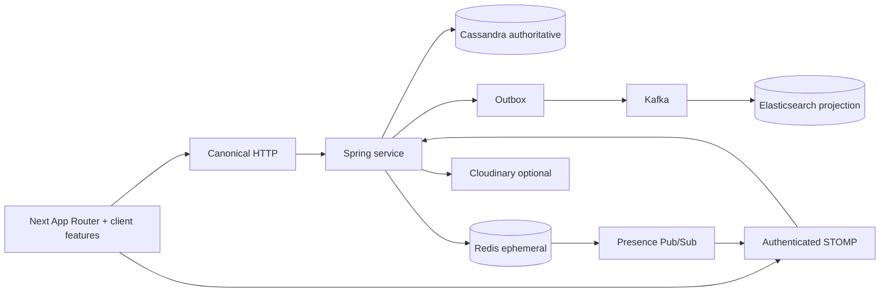

# Architecture

The backend is a Spring Boot service with Cassandra as the authoritative query-
designed store. Redis owns ephemeral typing/presence and distributed send-rate
state. Presence is an aggregate of per-STOMP-session heartbeats: an expiring
sorted set determines whether any device is active, while a user snapshot is
sent through Redis Pub/Sub so every Spring node can fan out to its local
WebSocket sessions. Kafka receives durable outbox events for downstream projections.
Elasticsearch is a rebuildable authorized search projection; Cloudinary is an
optional binary provider. STOMP over SockJS exposes authenticated realtime
commands and user/conversation destinations.

The frontend is React 19 + TypeScript with Zustand feature stores. Next.js 16
App Router is the only build/runtime entrypoint. Every supported URL now has a
native App Router entry; those entries delegate interactive feature trees to a
shared client shell. Browser-only APIs are behind explicit client boundaries;
there are no BrowserRouter hooks or secondary routing runtimes in source.

Global operators use the same frontend/backend deployment through a protected
`/admin` route and `/api/admin/**` controllers. App-level permissions are
server-authoritative; room-local conversation roles cannot grant global access.
The admin room list reads a monthly Cassandra projection rather than scanning
`conversations_by_id`.

WebRTC media is a native 1–1 browser peer connection owned by the frontend;
`CallController` authorizes membership and broadcasts short-lived, explicitly
targeted signalling events. `NEXT_PUBLIC_WEBRTC_ICE_SERVERS` is the only ICE
configuration boundary and has no provider fallback. Production NAT traversal
requires a reviewed STUN/TURN deployment; group/SFU calls are intentionally not
enabled by this contract.
