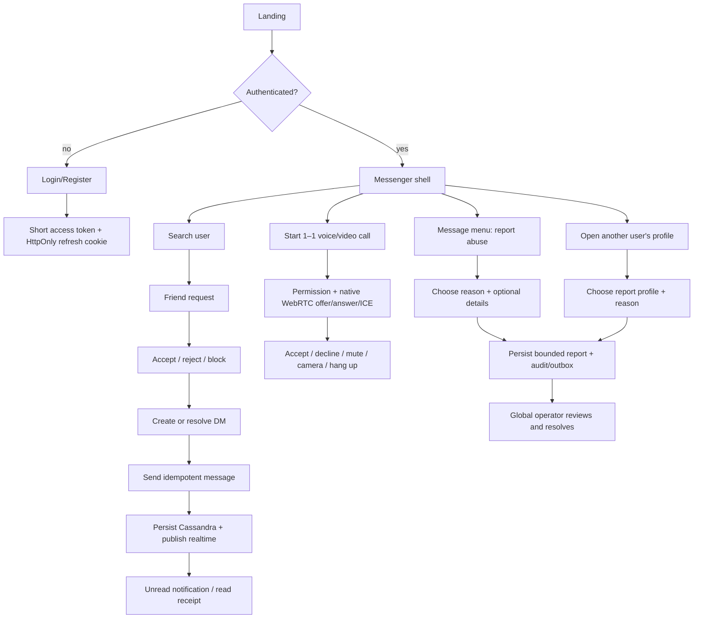
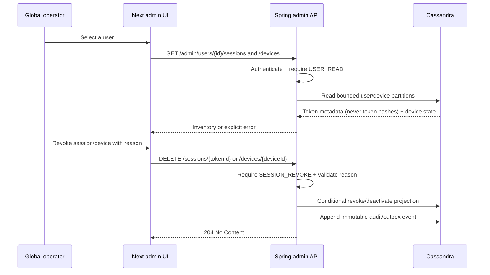

# User flows

Error exits: expired access token attempts one refresh; rejected refresh clears
the local session; a duplicate client message id returns the original message;
membership/permission failures are never hidden as empty success states. A
report cannot target the reporter's own account, and operator mutations require
an explicit audit reason.

## FLOW-ADMIN-001 — operator session/device control

Linked feature: `ID-ADMIN-001` (global admin workspace).

The inventory is bounded to the account partition. A device revoke uses a
conditional active-state update and revokes indexed refresh sessions for that
device; live multi-device Cassandra proof remains an integration gate.
