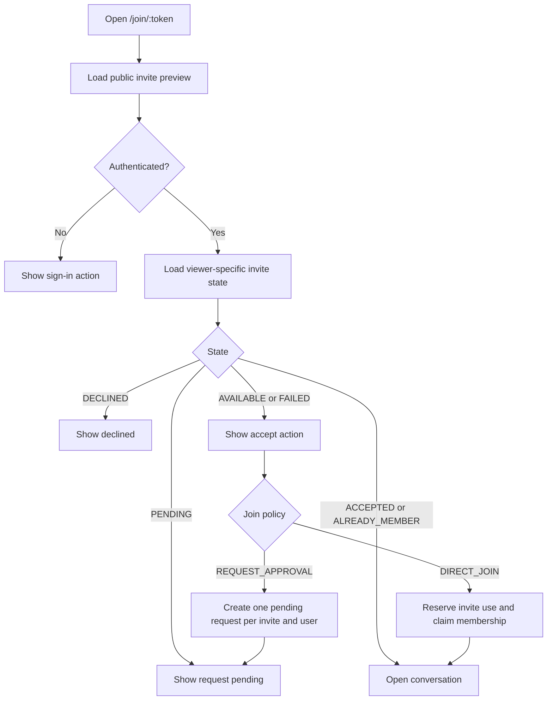
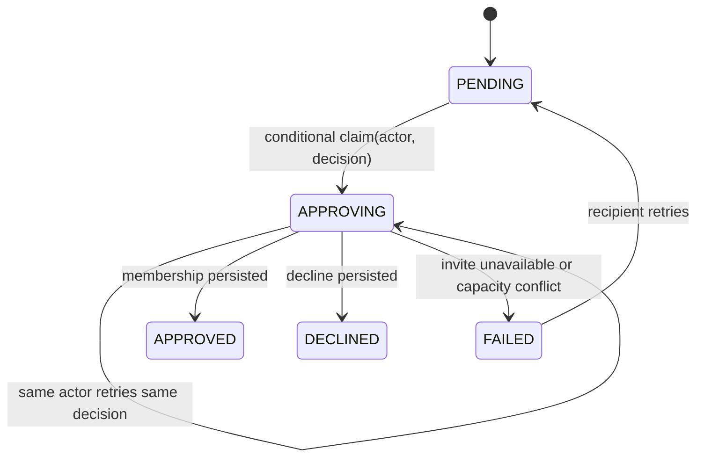

# Invite and join-approval flow

Stable flow ID: `FLOW-INVITE-001`
Feature: `ID-ROOM-003`

## Purpose and boundaries

A room manager creates or revokes a bounded invite. A recipient can inspect the
room without authentication, but viewer-specific state is returned only by the
authenticated `/invites/{token}/status` contract. This keeps a public preview
cacheable and prevents one recipient's decision from leaking to another.

The login action preserves `/join/:token` in the `from` parameter. Failed UI
requests preserve the current page and expose a retry; they never turn an
unknown response into a success state.

## Manager resolution and recovery

`resolution_decision` and `resolved_by` prevent an interrupted approval from
being resumed as a different decision or by a different manager. Invite-use
reservation is compensated when the membership capacity claim loses a race.
For a direct invite, an existing `ACCEPTED` recipient row means this user
already owns the reserved use: retry skips the use-count mutation and completes
the missing membership even when that reservation consumed the link's final
use. It is not reported to the browser as membership until the member row
exists.
Clean-Cassandra process-kill testing between invite-use reservation and member
creation remains required before claiming crash-atomic approval.

## Permissions, data and verification

- Creating, listing, revoking and resolving require `INVITE_MANAGE`.
- `invitation_links_by_token` owns token lookup and use-count CAS.
- `invite_join_by_link_user` owns recipient idempotency and permits an explicit
  `FAILED` to `PENDING` retry; it never silently treats an unknown status as new.
- `join_requests_by_conversation` is the manager queue. Its resolution claim is
  conditional and records actor plus decision.
- Java tests cover full-room preflight, race compensation, repeated membership
  repair, interrupted resolution continuation and decision mismatch.
- `test:e2e:room-management` covers progressive disclosure, create, revoke
  confirmation, approval, VI/EN switching, 390px layout and clean browser logs.
- `test:e2e:invites` proves public/authenticated separation, login return URL,
  pending-state restoration after reload, VI/EN copy and 390px layout.
