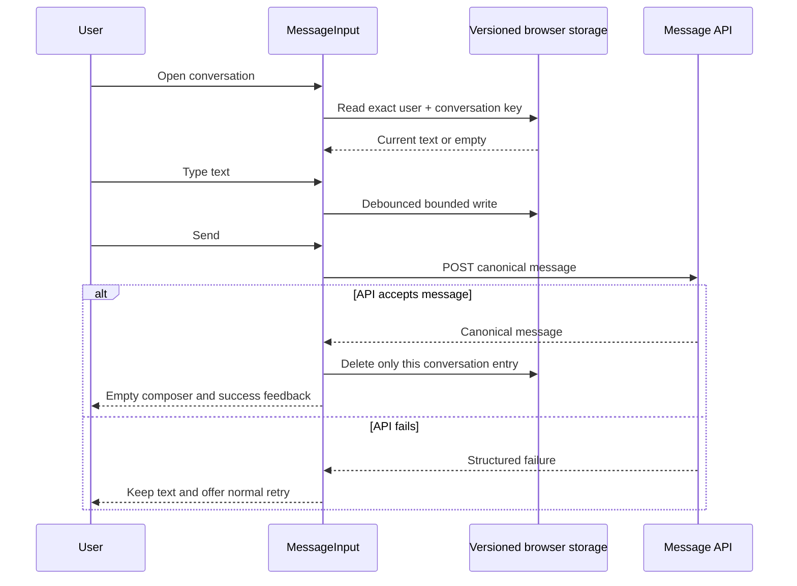

# Message draft ownership and recovery

Stable flow: `FLOW-MESSAGE-001`
Feature: `ID-MESSAGE-001`

## Purpose and boundaries

An authenticated user can leave a room, reload the app or recover from a failed
send without losing unsent text. Drafts are local to the current browser profile;
they are not durable server messages and never grant access to a conversation.

The storage authority is the exact tuple `(userId, conversationId)`. The current
schema stores text only, up to the canonical 20,000-character message limit, at
most 50 recent rooms and for no more than 30 days. Files are deliberately not
persisted because browsers cannot safely restore `File` objects after reload.
Editing uses separate state, so message content being edited never overwrites or
enters the unsent draft.

## State and user flow

```mermaid
stateDiagram-v2
    [*] --> Empty
    Empty --> Drafting: User types
    Drafting --> Persisted: 300 ms bounded write or room unmount
    Persisted --> Drafting: Reopen room or reload
    Drafting --> Editing: Edit an existing message
    Editing --> Drafting: Cancel or save edit
    Drafting --> Sending: Submit message
    Sending --> Drafting: HTTP failure; preserve text
    Sending --> Empty: HTTP success; delete this room draft
    Persisted --> Empty: Older than 30 days
```

## Validation, privacy and recovery

- Unknown, malformed or non-version-1 storage is removed, not migrated or
  interpreted through a compatibility shape.
- A second authenticated account uses a different key and cannot render the
  first account's draft through product UI.
- Successful message edits preserve the unrelated unsent draft. Editing does
  not emit typing state or persist edited content as a draft.
- Storage denial or quota failure leaves the in-memory composer usable and is
  recorded as a diagnostic warning without adding persistent UI clutter.
- Reload is the authoritative recovery check. WebSocket delivery is not used as
  proof that a draft or sent message is durable.

## Verification and observability

- `npm run test:e2e:message-drafts`: room isolation, full reload, expected send
  failure, successful-send cleanup, account isolation, invalid-schema deletion,
  canonical max length, mobile overflow, console and request-failure audit.
- `npm run test:e2e:message-edit`: cancel/save edit restores the unrelated draft.
- Diagnostic events omit draft content and log only storage operation failures.

Remaining distributed proof belongs to canonical message persistence and
realtime delivery, not to this device-local draft flow.
