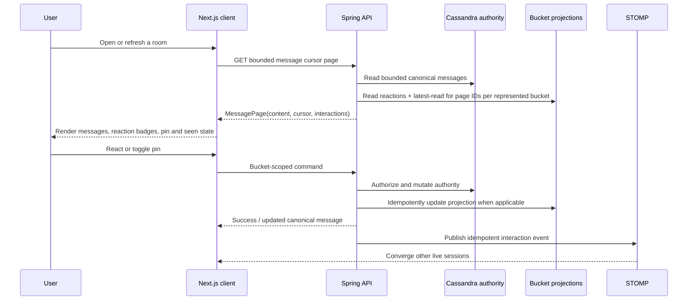
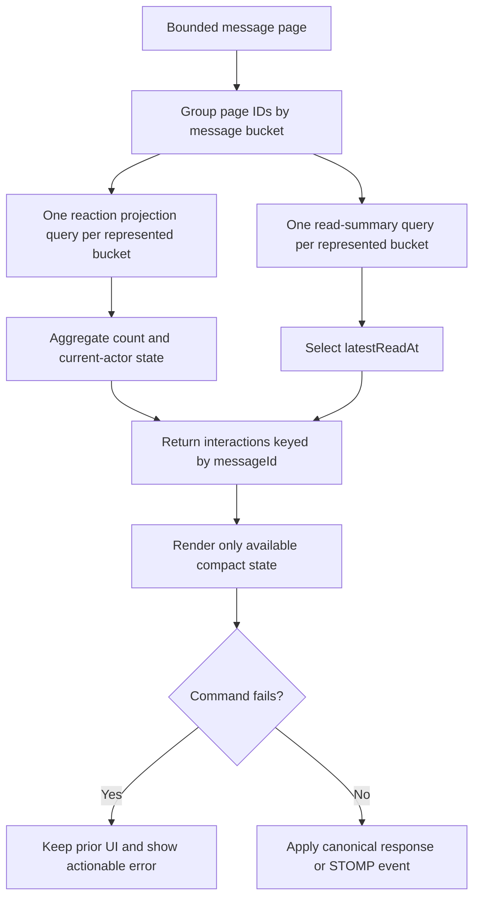

# FLOW-MESSAGE-002 — refresh-safe message interactions

Linked feature: `ID-MESSAGE-002`. Actors are an authenticated conversation
member and, for pinning, a member with `MESSAGE_PIN`. The postcondition is that
the current page and other live sessions converge on the same canonical state.

Deleted messages suppress reaction controls and badges. Missing interaction
rows mean no reaction or seen state; the client does not invent values. A
projection-write failure fails the command, and replay repairs the idempotent
reaction projection. Permission errors preserve the prior UI. Verification is
`CanonicalBackendServiceMessageTest`, the full Java suite and
`test:e2e:message-interactions`.
