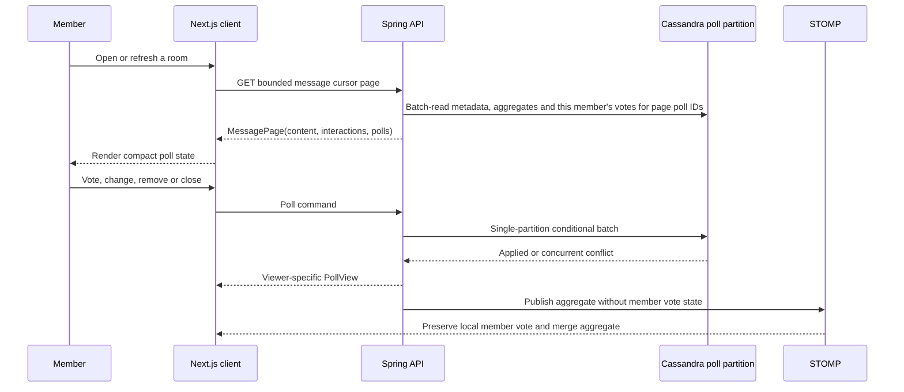

# FLOW-POLL-001 — bounded, viewer-safe polls

Linked feature: `ID-MESSAGE-003`. An authenticated conversation member can
restore poll state with the current message page. A member with `POLL_CREATE`
can create a poll; the creator or a member with `POLL_MANAGE` can close it.

Poll metadata is loaded only for poll IDs present in the returned message page.
The response includes aggregate counts plus the authenticated member's selected
indexes; it never includes voter identities. Realtime events contain only the
aggregate, so one member's choices cannot be delivered to another member.

Creation validation requires 2–10 unique non-empty options and a future deadline
when present. If creation fails, the modal stays open with the user's draft. The
UI exposes optional settings progressively and does not render a voter-detail
panel.

Verification: `CanonicalBackendServiceMessageTest`, the full Java 20 suite,
frontend validation/build, copy coverage, and `test:e2e:polls`.
