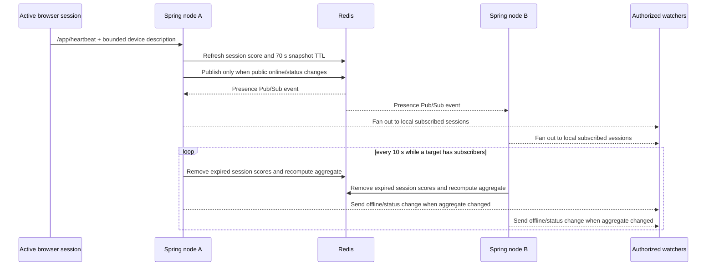
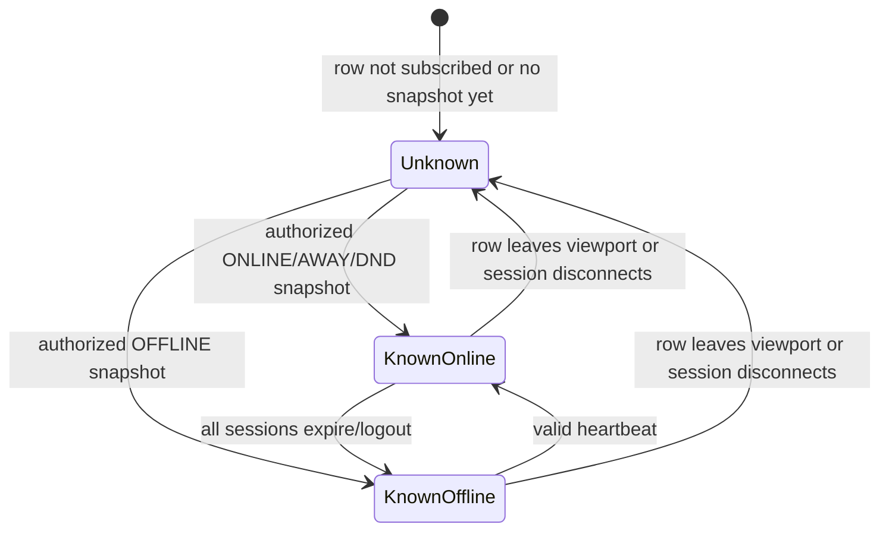
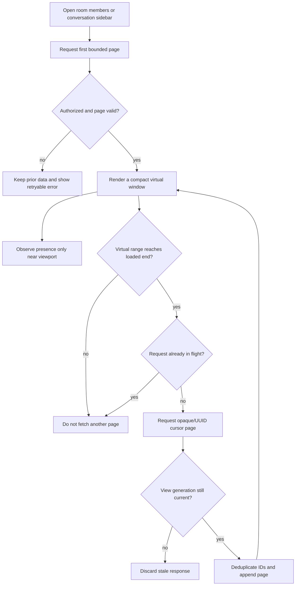

# Presence and large-directory flow

Stable flows: `FLOW-REALTIME-001`, `FLOW-DIRECTORY-001`  
Linked capabilities: `ID-REALTIME-001`, `ID-ROOM-002`, `ID-MESSAGE-001`

## Outcome and boundary

The application keeps two concerns separate:

- the member or conversation directory is durable, permission-scoped data read
  from Cassandra in bounded cursor pages;
- presence is short-lived Redis state delivered as an authorized STOMP event
  stream only for rows near the viewport.

This is a near-real-time snapshot, not proof of a person's physical activity.
The UI therefore renders no offline claim while a target has no authoritative
snapshot. A stored `INVISIBLE` preference is exposed to other users as
`OFFLINE`; it is never exposed as `INVISIBLE`.

## FLOW-REALTIME-001 — observe presence

Actors: authenticated watcher, observed friend or room member, browser STOMP
session, Spring node, Redis.  
Trigger: a rendered user row enters the viewport margin or the active view
changes.  
Preconditions: the watcher has an authenticated STOMP session and either an
accepted friendship or membership in the supplied conversation scope.  
Postcondition: the browser has the latest authorized public snapshot for only
the currently tracked targets; leaving the viewport releases the active scope
or transfers the target to another still-rendered authorized scope.

```mermaid
sequenceDiagram
  participant UI as Browser row
  participant PM as PresenceManager / tracker
  participant WS as Spring STOMP node
  participant DB as Cassandra authorization data
  participant R as Redis presence + Pub/Sub

  UI->>PM: Row enters 160 px viewport margin
  PM->>WS: /app/presence.subscribe (unique IDs, optional conversationId)
  WS->>DB: Verify watcher and every target are friends or room members
  alt unauthorized target or scope
    DB-->>WS: Not visible
    WS-->>PM: Reject command
    PM-->>UI: Keep presence unknown; show no guessed offline state
  else authorized and within 200 targets/session
    WS->>R: Read target snapshot and active session set
    R-->>WS: Public snapshot
    WS-->>PM: /user/queue/presence
    PM-->>UI: Render compact status
  end
  UI->>PM: Row leaves viewport margin
  PM->>WS: /app/presence.unsubscribe
  WS->>WS: Remove target from this STOMP session
```

The client owns one active authorization scope per target user. If the same
person is visible as both a friend and a room member, reference counts are kept
per scope but only one server subscription is active. When that active view
leaves, the tracker unsubscribes the old scope, clears the cached snapshot to
`unknown`, and subscribes through another still-rendered scope. This prevents a
snapshot authorized by a vanished view from silently surviving under a
different UI context.

### Heartbeat, multi-device aggregation and expiry



One active session keeps the aggregate online. Explicit logout removes only the
current STOMP session; the user becomes offline only after all sessions are
gone. Disconnect cleanup removes watcher subscriptions and the disconnected
actor's session. A reconnect must subscribe again and may request
`/app/presence.batch` for bounded resynchronization.



Failure and recovery rules:

- malformed events are rejected and never converted into a display status;
- Redis or STOMP loss leaves the last snapshot stale until reconnect, while the
  global network banner communicates connectivity loss;
- reconnect performs bounded subscription/batch synchronization rather than
  downloading a global presence list;
- leaving the final tracked scope deletes that user's cached snapshot, so a
  later row cannot briefly display stale online/offline state before its new
  subscription response;
- arbitrary UUID presence probing is forbidden;
- membership or friendship revocation after a successful subscription is not
  yet pushed into the subscription set immediately; cleanup currently occurs
  on unwatch/disconnect, so revocation-driven invalidation remains an explicit
  security hardening item.

Observability and evidence: correlation `requestId`/`traceId` fields are carried
by commands; logs omit user payloads. `PresenceServiceTest` covers fan-out,
expiry, aggregation and authorization. Frontend validation covers strict event
normalization. Live Redis multi-node reconnect and revocation invalidation are
not yet verified.

Rejected alternative: querying Cassandra again for every subscriber on every
presence event would fail closed after revocation, but it turns one popular
user's status change into an unbounded read burst. The selected future design
is a distributed access-revocation signal that removes affected local
subscriptions on every Spring node and neutralizes the relevant client scope.

## FLOW-DIRECTORY-001 — browse a large room or conversation list

Actors: authenticated member, browser list, Spring API, Cassandra.  
Trigger: initial directory open, or the virtualized member window reaching the
end of its loaded page.
Preconditions: the actor is authorized for the requested directory.  
Postcondition: exactly one additional cursor page is appended to client state;
only the current render window remains in the DOM and only near-viewport users
are subscribed for presence.



The room-management panel requests 50 members per page; the API default remains
100 and the server clamps an explicit limit to 1–500. The cursor is the last
authorized member UUID in Cassandra clustering order. Conversation sidebar
pages contain 30 rows and use the server's opaque projection cursor. A
virtualized member list loads at its rendered end, preserves the operator's
position after append so one arrival cannot cascade through every remaining
page, and keeps a localized load-more action in its measured footer. Neither
surface drains every page on mount.

Security and consistency rules:

- the server checks room membership before returning any member page;
- clients treat cursors as opaque except for the documented member UUID cursor;
- an in-flight guard prevents range/button duplicate requests;
- room generation guards discard a late member page after navigation;
- presence subscription and durable directory loading remain independent;
- unknown presence is neutral, and only near-viewport virtual rows create
  ephemeral tracking cost;
- subscribe/unsubscribe commands produced during one 50 ms viewport burst are
  deduplicated per authorization scope before STOMP delivery.

Evidence: `test:e2e:room-management` proves 50-row request limits,
scroll-triggered member pagination, a rendered DOM window smaller than loaded
member state, stale-room protection, bounded layout, and the sidebar's real
second-page HTTP request with the opaque server cursor. The deterministic
`test:presence:batcher` gate proves burst coalescing and enter/leave
cancellation. Clean Cassandra ordering/load evidence and a provider-backed
extreme-directory benchmark remain pending.
